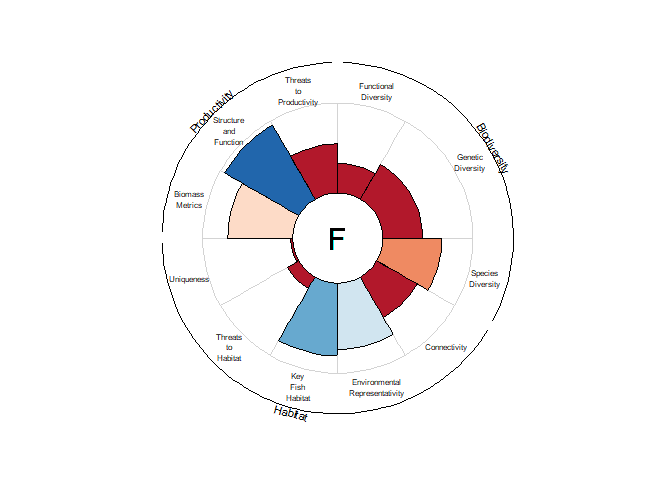

<!-- README.md is generated from README.Rmd. Please edit that file -->

# MarConsNetPipeline

<!-- badges: start -->
<!-- badges: end -->

The goal of MarConsNetPipeline is house the R-based Reproducible
Analytical Pipeline (RAP) for the monitoring and reporting on the
Maritimes Conservation Network.

``` r
require(targets)
#> Loading required package: targets
tar_make()
#> ✔ skipped target ind_placeholder_1_df
#> ✔ skipped target ind_placeholder_2_df
#> ✔ skipped target ind_placeholder_4_df
#> ✔ skipped target ind_placeholder_3_df
#> ✔ skipped target ind_placeholder_11_df
#> ✔ skipped target ind_placeholder_10_df
#> ✔ skipped target ind_placeholder_6_df
#> ✔ skipped target ind_placeholder_5_df
#> ✔ skipped target ind_placeholder_7_df
#> ✔ skipped target ind_placeholder_9_df
#> ✔ skipped target ind_placeholder_8_df
#> ✔ skipped target bin_biodiversity_FunctionalDiversity_df
#> ✔ skipped target bin_biodiversity_GeneticDiversity_df
#> ✔ skipped target bin_habitat_Connectivity_df
#> ✔ skipped target bin_biodiversity_SpeciesDiversity_df
#> ✔ skipped target bin_productivity_ThreatstoProductivity_df
#> ✔ skipped target bin_productivity_StructureandFunction_df
#> ✔ skipped target bin_habitat_KeyFishHabitat_df
#> ✔ skipped target bin_habitat_EnvironmentalRepresentativity_df
#> ✔ skipped target bin_habitat_ThreatstoHabitat_df
#> ✔ skipped target bin_productivity_BiomassMetrics_df
#> ✔ skipped target bin_habitat_Uniqueness_df
#> ✔ skipped target ecol_obj_biodiversity_df
#> ✔ skipped target ecol_obj_productivity_df
#> ✔ skipped target ecol_obj_habitat_df
#> ✔ skipped target pillar_ecol_df
#> ✔ skipped target flowerplot
#> ✔ skipped pipeline [0.19 seconds]
```

``` r
tar_visnetwork(degree_from = 6, degree_to = 0)
```

``` r
tar_load("flowerplot")
flowerplot
```

<!-- -->
